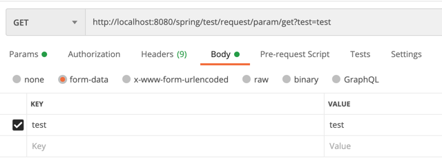

## RequestParam? RequestBody? PathVariable?

controller 에 parameter 를 전달하는 방법은 여러가지가 있는데, 대표적으로 RequestParam, RequestBody, PathVariable
이 있다.

이 방법들은 언어 그대로 parameter 로 그대로 보내는가(RequestParam), http 통신 중 body 에 실어서 보내는가(RequestBody),
url 에 명시하여 전달하는가(PathVariable) 로 이루어져 있다.

## 왜 알아야 하나?

그냥 문득 궁금해지기도 했고 사실 GET, POST 에 맞춰서 하려면 body 와 param 을 적절하게 나눠서 써야 한다고 생각해서 
확실하게 정리하고자 작성을 결심했다.

## 구성

먼저 `requestParam` 을 보면, 설명에 이미 대놓고 나와 있다.

>Annotation which indicates that a method parameter should be bound to a web
request parameter.
>
> ...
> 
>In Spring MVC, "request parameters" map to query parameters, form data,
  and parts in multipart requests. This is because the Servlet API combines
  query parameters and form data into a single map called "parameters", and
  that includes automatic parsing of the request body.
> In Spring WebFlux, "request parameters" map to query parameters only.
  To work with all 3, query, form data, and multipart data, you can use data
  binding to a command object annotated with {@link ModelAttribute}.

모든 web request 에 있어 parameter 가 범위에 있고 그러한 parameter 들에 대해
query param, form data, multipart request 등 `parameters` 로 명명하기에 해당 요청들에 대해
`RequestParam` 이 지원한다고 되어 있다.

```java
public class testController {
	@GetMapping(value = "/test/request/param/get")
	public void requestParamGetTest(@RequestParam(value = "test") String test) {
		System.out.println(test);
	}

	@PostMapping(value = "/test/request/param/post")
	public void requestParamPostTest(@RequestParam(value = "test") String test) {
		System.out.println(test);
	}	
}
```

이 두 가지 케이스 모두 이와 같은 요청을 할 경우엔

- requestParam request



결과 값으론 `"test": "test,test"` 로 요청이 된다.

이는 GET method 와 requestParam 의 속성 때문인데, 앞서 언급했듯이 RequestParam 은 
query param(URL encoding), form data, multipart 모두 요청으로써 받기 떄문에
form-data 형식으로 `"test": "test"` 를 전달하고, URL 내에 `test=test` 를 통해 하나의 변수에 대해
두 개의 요청을 받았고, string 형식이기에 append 하여 하나로 합쳐서 controller 에 전달하게 되었다.

이는 POST method 에서도 동일하게 발생한다.

- requestBody request

>Annotation indicating a method parameter should be bound to the body of the web request. The body of the request is passed through an HttpMessageConverter 
> to resolve the method argument depending on the content type of the request. Optionally, automatic validation can be applied by annotating the argument with @Valid.
Supported for annotated handler methods.

request body 의 경우 body 내에 저장하여 전달하기에 객체 전달에 용이하며, requestBody 에 명시되지 않은 데이터는
controller 에서 parameter 로 받아들이지 않기에 명확하게 전달이 가능하다.


이러한 요청에 혹여 url encoding 을 통해 전달을 하더라도 request body 에 mapping 이 되지 않았기에
controller 에 전달은 되지 않는다.

## 그래서?

java 에서 주관하는 객체 지향으로 생각을 한다면 모든 request 에 대해 RequestBody 로 object 를 통해 전달하고 
해당 object 에서 controller layer 에서 형변환 및 validation 을 하고 service 를 진행하게 하는게 아마 맞는 방향성일 것이다.

하지만 아주 작은 small data 에 대해 param 으로 처리하거나 key 값을 받아서 service 에 전달하는 식으로 한다면 간단하게 진행이 가능하기에
param 을 써도 무방하다고 생각된다.

결국 사용하기에 따라 다른것이라 본다.
~~그러니까 꾸준히 공부 해서 잘 쓰자~~

참고는 [여기](https://www.diffen.com/difference/GET-vs-POST-HTTP-Requests) 에서 참고 했다.